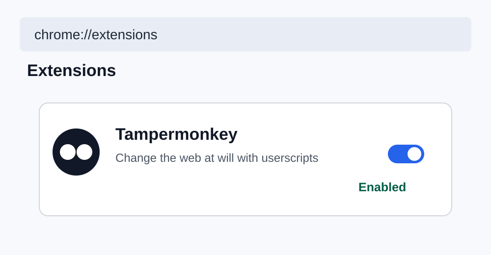
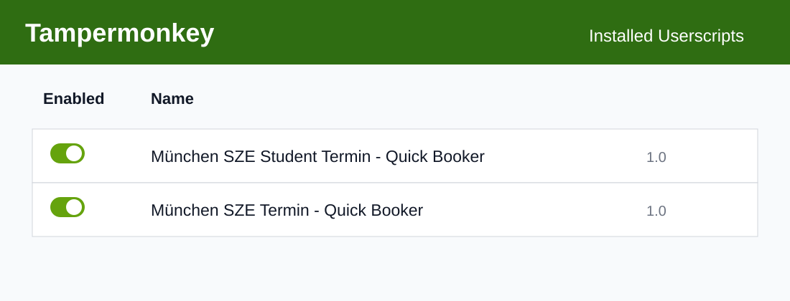
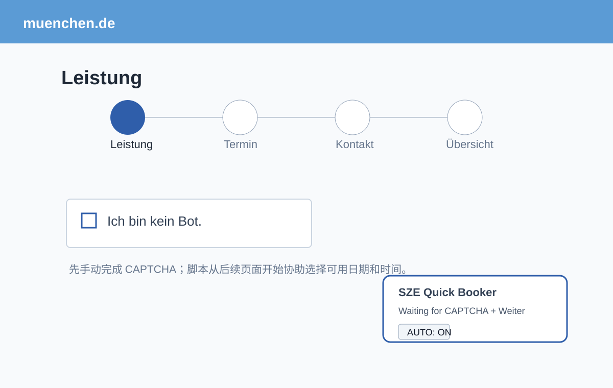

# 学生版：München SZE Notfall Termin Helper

适用于：**Studierende、Hochschulabsolvent*innen，以及官网列出的相关学生类 Notfall**。

## 预约入口

https://stadt.muenchen.de/buergerservice/terminvereinbarung.html#/services/10339027/locations/10187259

## 安装

1. Chrome 安装 Tampermonkey。
2. `chrome://extensions` → Tampermonkey → `Details` → 开启 **Allow User Scripts**。
3. Tampermonkey → `Create a new script`。
4. 复制仓库里的 [`scripts/munich-sze-notfall-helper.user.js`](../scripts/munich-sze-notfall-helper.user.js) 并保存。

## 使用

打开预约页后，右下角应该出现 **SZE Student Quick Booker** 和 `AUTO: ON`。

每一轮：

1. 手动点击 `Ich bin kein Bot.`
2. 完成人机验证。
3. 手动点击第一次 `Weiter`。
4. 进入 Termin 页面后，如果系统放出日期，脚本会尝试立即选择可用日期和时间段。
5. slot 成功后，脚本会尝试点击后续 `Weiter`。
6. 到 `Kontakt` 页面后停止，你自己完成后面的信息和最终提交。

如果显示 `NO TERMIN`，说明这一轮没有号。需要返回上一页，重新完成 CAPTCHA 后再查。脚本不会绕过验证码，也不会自行高频刷新服务器。

## 官网放号时间（截至 2026-09-24）

- 周一 / 周三 / 周五：**06:30**
- 周二 / 周四：**07:30**
- 官网说明是当天的短期 Notfalltermine

官方页面：  
https://stadt.muenchen.de/service/info/servicestelle-fur-zuwanderung-und-einburgerung/10338844/

> Notfall 是否成立由 SZE 判断。请先确认自己符合官网条件并准备相应证明。
